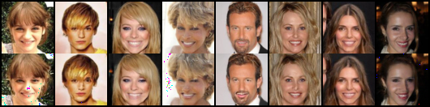

# pytorch-glow
PyTorch implementation of "Glow: Generative Flow with Invertible 1x1 Convolutions"

## Result
### Reconstruction

### Interpolation
From left to right, the attribute offset is from `-1.0` to `1.0` by step `0.25`.

- Attractive

- Black hair

- Blurry

- Mouth slightly open

